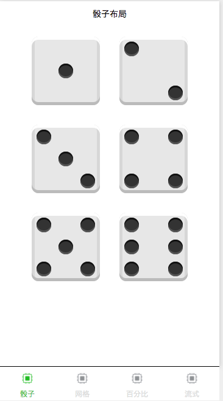
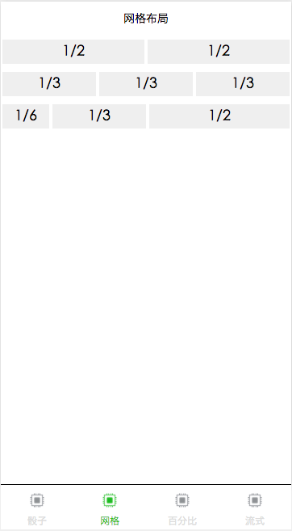
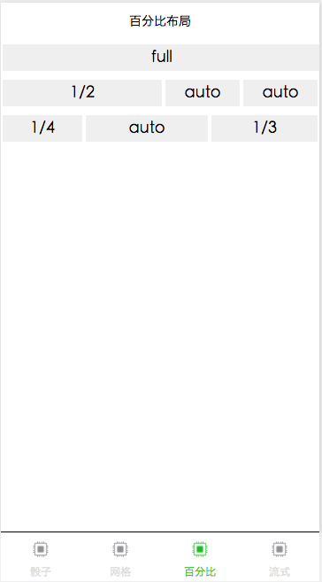
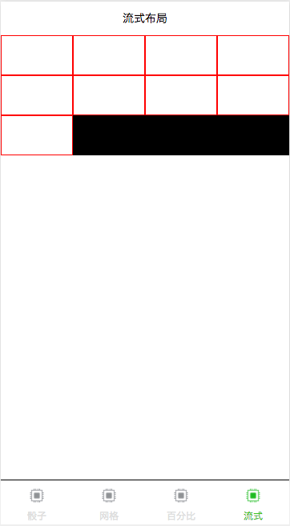

# wxflex
微信小程序的Flex布局demo－4种必备常用的Flex布局模式

## 微信小程序开发论坛

垂直微信小程序开发交流社区:[http://weappdev.com](http://weappdev.com)

## 官方建议的Flex布局

> Flex的布局相比传统的float布局来说，简单、快捷、方便。掌握flex布局可以在制作微信小程序时减少wxss的代码，同时也符合微信小程序开发的文档要求

本代码中涉及到四种Flex的布局方式，分别使用了不同的flex的不同属性。
建议看本文最后的学习参考进行相关属性的学习


## 骰子布局

> 骰子布局中主要强调几个属性的使用`display` `justify-content` `align-items` `align-self`等

```
.first-face {
  display: flex;
  justify-content: center;
  align-items: center;
}

.second-face {
  display: flex;
  justify-content: space-between;
}

.second-pip-2 {
  align-self: flex-end;
}

```





## 网格布局

> 主要依赖flex属性

```
.Grid {
  display: flex;
}
.Grid-cell {
  flex: 1;
}

```



## 百分比布局

```
.Grid {
  display: flex;
}

.cell-u-full {
  flex: 0 0 100%;
}

```



## 流式布局

```
.parent {
  width: 100%;
  background-color: black;
  display: flex;
  flex-flow: row wrap;
  align-content: flex-start;
}

.child {
  box-sizing: border-box;
  background-color: white;
  flex: 0 0 25%;
  height: 50px;
  border: 1px solid red;
}

```



## Flex 学习参考

 * 本代码参考[阮一峰的网络日志:Flex 布局教程：实例篇](http://www.ruanyifeng.com/blog/2015/07/flex-examples.html)编写

 * 语法学习 [阮一峰的网络日志:Flex 布局教程：语法篇](http://www.ruanyifeng.com/blog/2015/07/flex-grammar.html)

